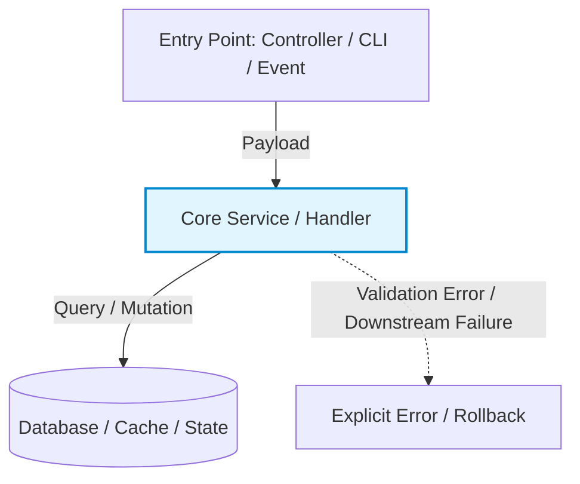

# Phase 3: Design (Architecture)

**Goal:** Design the approach before writing code. Future-proof without overengineering.

*Skip this phase for `mechanical` profile changes (simple renames, typos, trivial config).*

---

## 1. Freeze the Evidence Packet
Before designing, isolate the problem from the solution:
- **Violated Property & Expected Outcome:** What is broken or missing, and what must happen instead.
- **Constraints & Invariants:** Existing working workflows, contracts, and performance thresholds that cross the same code and MUST NOT break.
- **Source Anchors:** Exact `file:line` references for entry points, data flows, and callers actually verified in the codebase.
- **Unknowns:** Unresolved facts. Name them explicitly; never disguise an assumption as a requirement.

---

## 2. Independent Solution Exploration (Dual Analysis)
Do not force artificial strawmen (e.g., do not invent a fake "massive rewrite" for a 1-line bug fix). Instead, seek independent perspective:
- **Pass the Evidence Packet to two independent analyses** (or two isolated subagents/turns) without cross-contamination. Each designs the most appropriate solution based strictly on the evidence.
- **Evaluate Consensus vs. Divergence:**
  - **Natural Consensus:** If both independently arrive at the same mechanism, high confidence exists that this is the correct, minimal-risk path.
  - **Divergence:** If they propose different mechanisms, do NOT average them into a sloppy compromise. Compare the trade-offs: Which one has fewer moving parts? Which makes fewer unverified assumptions? Which preserves invariants with less blast radius?
- If only one approach is physically viable, state the hard code constraints that rule out alternatives.

---

## 3. Challenge the Design (Prevent Overengineering)
Before locking the architecture, actively challenge it:
- **Simplicity test:** Is there a simpler, more direct way to solve this?
- **Necessity test:** Is any proposed abstraction, interface, helper, or indirection unnecessary?
- **Completeness test:** Does it handle edge cases and failure modes identified in the contract?
- **Coupling check:** Does this introduce unintended dependencies between components?
- **Scale check:** Does this change fit the actual system scale, avoiding optimization for hypothetical loads at the expense of real complexity?

---

## 4. Visual Architecture Diagram (Mandatory)
Every non-mechanical design must produce a concrete, accurate Mermaid diagram showing the components involved in the change.

### Requirements for the diagram:
- **Ground truth only:** Map actual components, files, services, and data flows. No imaginary boxes or speculative layers.
- **Highlight the change surface:** Clearly differentiate existing components from modified or new components.
- **Show data and failure boundaries:** Where does input enter, how does state transform, and where could an error occur?
- **Purpose:** A reviewer must be able to understand the entire change and spot architectural bugs just by inspecting this diagram.

---

## 5. Temporal Contracts (For Persistent State)
If the change introduces or modifies state that outlives a single function call (sessions, caches, database records, files):
- **Ownership:** Which component owns, updates, and destroys this state?
- **Lifecycle & Cleanup:** What clears or expires it? What happens on process crash or restart?
- **Concurrency:** How are simultaneous updates or race conditions prevented?
- **Transition Model:** Define the state transitions: `pre-state + trigger → outcome + post-state`.

---

## 6. Record Decisions and Assumptions
- Record what was decided and the concrete reason why.
- Record any alternative considered and why it was set aside.
- Any assumption that cannot be verified right now must be listed as a verification target for Phase 6 (Verify).

---

## Complete when:
- The design solves the contract without unnecessary abstractions.
- The visual architecture diagram is complete, accurate, and reflects actual code boundaries.
- The design has survived the simplicity challenge and is approved for implementation.

